# Docker buildx

## 导入来源：智能导入

## 识别来源

来源文档：[[Mino17 红外相机 RK3588 C++ 采集推流方案汇报]]

# Mino17 红外相机 RK3588 C++ 采集推流方案汇报

## 1. 项目目标

本项目目标是将原先基于 `ffmpeg` 命令行的红外相机采集推流流程，改造为 **C/C++ 直接调用 FFmpeg/libav 库 API** 的方式，并封装为可在 RK3588 板卡上直接部署运行的 Docker 镜像包。

当前已完成：

- Mino17 红外相机采集：`/dev/video59`
- 输入格式：`640x518 UYVY 50fps`
- 有效画面：`640x512`
- 底部 6 行：机芯冗余观测数据，当前按冗余行裁掉
- 编码方式：`h264_rkmpp`
- 推流地址：`rtmp://127.0.0.1:1935/ghostapp/uav0`
- 流媒体服务：ZLMediaKit
- 播放协议：RTMP / HTTP-FLV / HLS / RTSP

## 2. 总体流程图

```mermaid
flowchart LR
    A["Mino17 红外相机<br/>/dev/video59<br/>640x518 UYVY 50fps"] --> B["C++ 采集层<br/>FFmpeg libavdevice/libavformat<br/>av_find_input_format(v4l2)<br/>avformat_open_input"]

    B --> C["取包/解码<br/>libavcodec<br/>avcodec_send_packet<br/>avcodec_receive_frame"]

    C --> D["图像整理<br/>裁剪 640x518 -> 640x512<br/>去除底部 6 行冗余数据"]

    D --> E["伪彩与格式转换<br/>CPU pseudo-color<br/>libswscale sws_scale<br/>RGB24 -> NV12"]

    E --> F["硬件编码<br/>libavcodec<br/>h264_rkmpp<br/>RK3588 MPP 硬编码"]

    F --> G["封装推流<br/>libavformat<br/>FLV/RTMP mux<br/>av_interleaved_write_frame"]

    G --> H["ZLMediaKit<br/>RTMP 接收<br/>ghostapp/uav0"]

    H --> I["播放与分发<br/>RTMP / HTTP-FLV / HLS / RTSP"]
```



## 3. 是否满足“ffmpeg 命令改为 C/C++ 调库”

结论：**满足。**

正式采集链路中不再执行如下命令行形式：

```bash
ffmpeg -f v4l2

## 知识增补：2026-07-10 16:35:07

> 输入：这个节点现在内容太像项目汇报，不够像 Docker buildx 的知识沉淀。请补充 Docker buildx 是什么、为什么用于 x86 构建 ARM64 镜像、本项目里怎么用、常用命令和注意点。

### 本次补充
Docker buildx 是 Docker 官方提供的 CLI 插件，用于构建**多架构（multi-arch）容器镜像**。在本项目（RK3588 红外相机采集推流）中，开发机为 x86_64，部署目标为 ARM64 架构的 RK3588 板卡，因此必须使用 buildx 实现 **x86 主机上构建 ARM64 镜像**，省去交叉编译环境搭建或直接在板卡上构建的麻烦。

### 关键点
- **是什么**：`docker buildx` 扩展了原生 `docker build`，支持通过不同的 builder（可基于 QEMU 或远程节点）一次性构建并推送多个平台镜像，最终生成 manifest list（镜像列表）供目标架构拉取对应层。
- **为什么在本项目重要**：开发环境是 x86，目标板卡 RK3588 是 ARM64（aarch64）；若直接 `docker build` 会生成 x86 镜像，无法在板卡上运行。使用 `docker buildx build --platform linux/arm64` 即可在 x86 主机上为 ARM64 构建镜像，避免维护两套构建环境。
- **本项目用法**（参考导入的项目汇报）：
  1. 确保开启 Docker 实验特性（`/etc/docker/daemon.json` 设置 `"experimental": true`）并安装 `docker-buildx` 插件。
  2. 创建 builder：`docker buildx create --name mybuilder --bootstrap --driver docker-container --platform linux/arm64`
  3. 切换到该 builder：`docker buildx use mybuilder`
  4. 构建并推送：`docker buildx build --platform linux/arm64 -t repo/image:tag --push .`\
     其中 Dockerfile 需包含 FFmpeg、libavdevice、h264_rkmpp、ZLMediaKit 等依赖的编译安装。
- **注意点**：
  - ARM64 下部分基础镜像（如 `ubuntu:22.04`）需使用 `arm64v8` 版本，或通过 buildx 自动解析。
  - 硬件编码库 `h264_rkmpp` 依赖 RK3588 的 MPP 驱动，构建时需使用板卡系统上的 `/usr/lib/aarch64-linux-gnu/` 下的动态库，建议在 Dockerfile 中拷贝进镜像或通过 multi-stage 构建。
  - QEMU 模拟构建 ARM64 镜像较慢，可考虑在 RK3588 板卡上运行一个远程 builder（`docker context` + `docker buildx create --name remote-builder`），利用板卡原生 CPU 编译加速。
  - 确保 builder 有足够磁盘空间（编译 FFmpeg 等大型库时临时文件较多）。

## 知识增补：2026-07-10 16:35:41

> 输入：这个节点现在内容太像项目汇报，不够像 Docker buildx 的知识沉淀。请补充 Docker buildx 是什么、为什么用于 x86 构建 ARM64 镜像、本项目里怎么用、常用命令和注意点。

### 本次补充

Docker buildx 是 Docker 官方 CLI 插件，用于构建**多架构（multi-arch）容器镜像**。在本项目（RK3588 红外相机采集推流）中，开发机为 x86_64，部署目标为 ARM64 架构的 RK3588 板卡，因此必须使用 buildx 实现 **x86 主机上构建 ARM64 镜像**，省去交叉编译环境搭建或直接在板卡上构建的麻烦。

### 关键点
- **是什么**：`docker buildx` 扩展原生 `docker build`，支持通过不同 builder（基于 QEMU 或远程节点）一次性构建并推送多个平台镜像，生成 manifest list 供目标架构拉取对应层。
- **为什么在本项目重要**：开发环境 x86，目标板卡 RK3588 是 ARM64（aarch64）；直接 `docker build` 会生成 x86 镜像，无法在板卡运行。使用 `docker buildx build --platform linux/arm64` 即可在 x86 主机上为 ARM64 构建，避免维护两套构建环境。
- **本项目用法**：
  1. 开启 Docker 实验特性：`/etc/docker/daemon.json` 设置 `"experimental": true`，安装 `docker-buildx` 插件。
  2. 创建 builder：`docker buildx create --name mybuilder --bootstrap --driver docker-container --platform linux/arm64`
  3. 使用：`docker buildx use mybuilder`
  4. 构建并推送：`docker buildx build --platform linux/arm64 -t repo/image:tag --push .`
- **注意点**：
  - ARM64 基础镜像需使用 `arm64v8/` 前缀或通过 buildx 自动解析。
  - 硬件编码库 `h264_rkmpp` 依赖 RK3588 的 MPP 驱动，构建时需从板卡拷贝系统库（如 `/usr/lib/aarch64-linux-gnu/`）到镜像中。
  - QEMU 模拟构建较慢，可考虑在 RK3588 上运行远程 builder（`docker context` + `docker buildx create --name remote`）利用原生 CPU 加速编译。

## 知识增补：2026-07-10 16:35:52

> 输入：这个节点现在内容太像项目汇报，不够像 Docker buildx 的知识沉淀。请补充 Docker buildx 是什么、为什么用于 x86 构建 ARM64 镜像、本项目里怎么用、常用命令和注意点。

### 本次补充

当前文档内容过多地保留了原始项目汇报的细节（如相机规格、流程图、验收结论），偏离了「Docker buildx」知识节点的定位。以下是对 Docker buildx 在本项目场景下的工程实践沉淀，聚焦工具概念、用途、用法与常见陷阱。

### 关键点

- **是什么**：`docker buildx` 是 Docker 官方的 CLI 插件，用于构建**多架构（multi-arch）镜像**。它通过不同类型的 builder（基于 QEMU 模拟或远程 Docker 主机）在单一主机上为多个平台（如 `linux/amd64`、`linux/arm64`）编译镜像，并生成一个 manifest list，拉取时自动匹配目标架构的层。

- **为什么在本项目重要**：开发机为 x86_64，部署目标为 RK3588（ARM64 / aarch64）。如果直接 `docker build` 会产生 x86_64 镜像，无法在板卡上运行。使用 buildx 可在 x86 主机上为 ARM64 构建镜像，无需搭建交叉编译环境或将源码复制到板卡上编译，显著简化 CI/CD 流程。

- **本项目用法**（从汇报中提炼）：  
  1. 启用 Docker 实验特性：在 `/etc/docker/daemon.json` 添加 `"experimental": true`，重启 Docker。  
  2. 安装 `docker-buildx` 插件（通常随 Docker 桌面版自带，Linux 需单独安装）。  
  3. 创建支持 ARM64 的 builder：  
     ```bash
     docker buildx create --name mybuilder --bootstrap --driver docker-container --platform linux/arm64
     docker buildx use mybuilder
     ```  
  4. 构建并推送 ARM64 镜像：  
     ```bash
     docker buildx build --platform linux/arm64 -t your-registry/infrared-streamer:v1 --push .
     ```  
  5. Dockerfile 中需包含 FFmpeg、libavdevice、h264_rkmpp（RK MPP 驱动）、ZLMediaKit 等依赖的编译安装步骤。

- **注意点**：  
  - ARM64 基础镜像使用 `arm64v8/ubuntu:22.04`，或直接用 `--platform linux/arm64` 让 buildx 自动选择对应 tag。  
  - 硬件编码库 `h264_rkmpp` 依赖 RK3588 的 MPP 运行时库（`librk_mpp.so` 等），构建时需从板卡系统拷贝 `/usr/lib/aarch64-linux-gnu/` 下的动态库到镜像中，或通过 multi-stage 将板卡导出的库层与编译产物合并。  
  - QEMU 模拟构建 ARM64 镜像速度较慢（尤其编译 FFmpeg 时），推荐在 RK3588 板卡上运行远程 Docker 守护进程，然后通过 `docker context` 连接板卡，创建远程 builder：  
    ```bash
    docker context create rk3588 --docker host=ssh://user@rk3588-ip
    docker buildx create --name remote-builder --driver docker-container --context rk3588 --platform linux/arm64
    ```  
  - 确保构建缓存挂载（`--cache-to` / `--cache-from`）以减少重复编译时间，特别是 FFmpeg 这种大型库。
