# Docker

# Docker

## 导入来源：智能导入

## 识别来源

来源文档：[[Mino17 红外相机 RK3588 C++ 采集推流方案汇报]]

# Mino17 红外相机 RK3588 C++ 采集推流方案汇报

## 1. 项目目标

本项目目标是将原先基于 `ffmpeg` 命令行的红外相机采集推流流程，改造为 **C/C++ 直接调用 FFmpeg/libav 库 API** 的方式，并封装为可在 RK3588 板卡上直接部署运行的 Docker 镜像包。

当前已完成：

- Mino17 红外相机采集：`/dev/video59`
- 输入格式：`640x518 UYVY 50fps`
- 有效画面：`640x512`
- 底部 6 行：机芯冗余观测数据，当前按冗余行裁掉
- 编码方式：`h264_rkmpp`
- 推流地址：`rtmp://127.0.0.1:1935/ghostapp/uav0`
- 流媒体服务：ZLMediaKit
- 播放协议：RTMP / HTTP-FLV / HLS / RTSP

## 2. 总体流程图

```mermaid
flowchart LR
    A["Mino17 红外相机<br/>/dev/video59<br/>640x518 UYVY 50fps"] --> B["C++ 采集层<br/>FFmpeg libavdevice/libavformat<br/>av_find_input_format(v4l2)<br/>avformat_open_input"]

    B --> C["取包/解码<br/>libavcodec<br/>avcodec_send_packet<br/>avcodec_receive_frame"]

    C --> D["图像整理<br/>裁剪 640x518 -> 640x512<br/>去除底部 6 行冗余数据"]

    D --> E["伪彩与格式转换<br/>CPU pseudo-color<br/>libswscale sws_scale<br/>RGB24 -> NV12"]

    E --> F["硬件编码<br/>libavcodec<br/>h264_rkmpp<br/>RK3588 MPP 硬编码"]

    F --> G["封装推流<br/>libavformat<br/>FLV/RTMP mux<br/>av_interleaved_write_frame"]

    G --> H["ZLMediaKit<br/>RTMP 接收<br/>ghostapp/uav0"]

    H --> I["播放与分发<br/>RTMP / HTTP-FLV / HLS / RTSP"]
```



## 3. 是否满足“ffmpeg 命令改为 C/C++ 调库”

结论：**满足。**

正式采集链路中不再执行如下命令行形式：

```bash
ffmpeg -f v4l2

## 导入来源：项目资料包

## 自动识别依据

### WSL2 Ubuntu 22.04 Docker Engine 与 Buildx 安装配置
# WSL2 Ubuntu 22.04 Docker Engine 与 Buildx 安装配置

### 目标
## 目标

在 Windows 的 WSL2 Ubuntu 22.04 环境中安装 Docker 官方 Docker Engine、Docker CLI、containerd、Buildx 和 Compose 插件，并确保 Docker daemon 由 systemd 管理，解决 `Docker daemon 未运行`、`/var/run/docker.sock 不存在`、`docker version 只有 Client 没有 Server` 等问题。

### 适用场景
## 适用场景

- Windows 上使用 WSL2 作为 Linux 开发环境。
- Ubuntu 22.04 发行版需要本地运行 Docker Engine。
- 需要使用 `docker buildx` 构建镜像，或做跨架构镜像构建前的环境准备。
- 不依赖 Docker Desktop，而是在 WSL 内直接安装 Docker 官方软件包。
