# Linux Shell

# Linux Shell

# Linux Shell

## 导入来源：智能导入

## 识别来源

来源文档：[[Mino17 红外相机 RK3588 C++ 采集推流方案汇报]]

# Mino17 红外相机 RK3588 C++ 采集推流方案汇报

## 1. 项目目标

本项目目标是将原先基于 `ffmpeg` 命令行的红外相机采集推流流程，改造为 **C/C++ 直接调用 FFmpeg/libav 库 API** 的方式，并封装为可在 RK3588 板卡上直接部署运行的 Docker 镜像包。

当前已完成：

- Mino17 红外相机采集：`/dev/video59`
- 输入格式：`640x518 UYVY 50fps`
- 有效画面：`640x512`
- 底部 6 行：机芯冗余观测数据，当前按冗余行裁掉
- 编码方式：`h264_rkmpp`
- 推流地址：`rtmp://127.0.0.1:1935/ghostapp/uav0`
- 流媒体服务：ZLMediaKit
- 播放协议：RTMP / HTTP-FLV / HLS / RTSP

## 2. 总体流程图

```mermaid
flowchart LR
    A["Mino17 红外相机<br/>/dev/video59<br/>640x518 UYVY 50fps"] --> B["C++ 采集层<br/>FFmpeg libavdevice/libavformat<br/>av_find_input_format(v4l2)<br/>avformat_open_input"]

    B --> C["取包/解码<br/>libavcodec<br/>avcodec_send_packet<br/>avcodec_receive_frame"]

    C --> D["图像整理<br/>裁剪 640x518 -> 640x512<br/>去除底部 6 行冗余数据"]

    D --> E["伪彩与格式转换<br/>CPU pseudo-color<br/>libswscale sws_scale<br/>RGB24 -> NV12"]

    E --> F["硬件编码<br/>libavcodec<br/>h264_rkmpp<br/>RK3588 MPP 硬编码"]

    F --> G["封装推流<br/>libavformat<br/>FLV/RTMP mux<br/>av_interleaved_write_frame"]

    G --> H["ZLMediaKit<br/>RTMP 接收<br/>ghostapp/uav0"]

    H --> I["播放与分发<br/>RTMP / HTTP-FLV / HLS / RTSP"]
```



## 3. 是否满足“ffmpeg 命令改为 C/C++ 调库”

结论：**满足。**

正式采集链路中不再执行如下命令行形式：

```bash
ffmpeg -f v4l2

## 导入来源：项目资料包

## 自动识别依据

### Windows PowerShell 中确认 WSL 版本
## Windows PowerShell 中确认 WSL 版本

```powershell
wsl -l -v
wsl --version
```

预期发行版类似：

```text
NAME            STATE     VERSION
Ubuntu-22.04    Running   2
```

如果是 WSL 1：

```powershell
wsl --set-version Ubuntu-22.04 2
wsl --update
```

### WSL Ubuntu 中启用 systemd
## WSL Ubuntu 中启用 systemd

进入 Ubuntu 后检查：

```bash
ps -p 1 -o comm=
```

如果输出：

```text
systemd
```

可以直接继续安装 Docker。

如果输出：

```text
init
```

创建 `/etc/wsl.conf`：

```bash
sudo tee /etc/wsl.conf >/dev/null <<'EOF'
[boot]
systemd=true
EOF
```

然后回到 Windows PowerShell：

```powershell
wsl --shutdown
```

重新打开 Ubuntu，再执行：

```bash
ps -p 1 -o comm=
```

预期输出：

```text
systemd
```

systemd 正常后，WSL 可以用 `systemctl` 管理 `docker.service` 和 `containerd.service`。

### 卸载可能冲突的 Docker 包
## 卸载可能冲突的 Docker 包

在 WSL Ubuntu 中执行：

```bash
sudo apt-get remove -y   docker.io   docker-doc   docker-compose   docker-compose-v2   podman-docker   containerd   runc
```

有些包提示未安装可以忽略。这个步骤用于避免 Ubuntu 自带 Docker、旧版 Compose、旧 containerd/runc 与 Docker 官方软件包冲突。

## 导入来源：项目资料包

## 自动识别依据

### Git 基础配置
## Git 基础配置

```bash
git config --global user.name "你的名字"
git config --global user.email "你的邮箱"
git config --global --list
git config --list
```

说明：

| 命令 | 作用 |
|---|---|
| `git config --global user.name "你的名字"` | 设置全局用户名 |
| `git config --global user.email "你的邮箱"` | 设置全局邮箱 |
| `git config --global --list` | 查看全局配置 |
| `git config --list` | 查看当前仓库配置 |

### 创建与克隆仓库
## 创建与克隆仓库

```bash
git init
git clone <url>
git clone <url> <目录名>
```

说明：

| 命令 | 作用 |
|---|---|
| `git init` | 在当前目录初始化新仓库 |
| `git clone <url>` | 克隆远程仓库到本地 |
| `git clone <url> <目录名>` | 克隆到指定目录 |

### 日常操作：工作区、暂存区、本地仓库
## 日常操作：工作区、暂存区、本地仓库

工作流：

```text
工作区 --git add--> 暂存区 --git commit--> 本地仓库
```

常用命令：

```bash
git status
git status -s
git add <文件>
git add .
git add -A
git commit -m "提交信息"
git commit -am "信息"
git commit --amend
git restore <文件>
git restore --staged <文件>
git reset HEAD~1
git reset --hard HEAD~1
```

说明：

| 命令 | 作用 |
|---|---|
| `git status` | 查看工作区和暂存区状态 |
| `git status -s` | 简洁模式显示状态 |
| `git add <文件>` | 将指定文件加入暂存区 |
| `git add .` | 将当前目录下变更加入暂存区 |
| `git add -A` | 加入所有变更，包括删除操作 |
| `git commit -m "提交信息"` | 提交暂存区到本地仓库 |
| `git commit -am "信息"` | 跳过 `git add`，直接提交已跟踪文件 |
| `git commit --amend` | 修改最近一次提交的消息或内容 |
| `git restore <文件>` | 撤销未暂存的工作区修改 |
| `git restore --staged <文件>` | 从暂存区撤出，不丢失文件修改 |
| `git reset HEAD~1` | 撤销最近一次 commit，保留修改 |
| `git reset --hard HEAD~1` | 撤销最近一次 commit 并丢弃修改，危险 |

注意：多人协作或不确定时，不要轻易使用 `git reset --hard`。它会丢弃工作区修改和提交后的历史。
