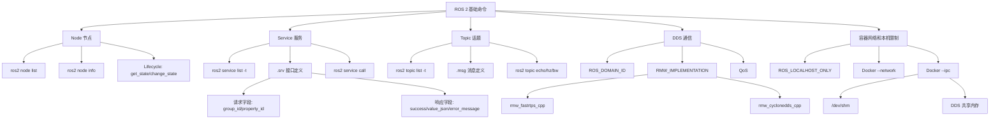

# ROS 2 基础命令排障图谱：Service、Topic、DDS、RMW、IPC

这篇笔记把 `ROS 2 基础命令` 当作中心节点，用它连接节点发现、服务调用、话题消息、DDS/RMW、Docker IPC 和跨容器网络排障。目标不是背概念，而是拿到一个新设备或新容器后，知道先输入什么命令、每一步看什么结果、失败时往哪个底层点排查。

## 1. 中心节点：ROS 2 基础命令

最小确认顺序：

```bash
ros2 --version
env | grep -E "ROS_|RMW_"

ros2 node list
ros2 node info /hal_device_mino17_0

ros2 service list -t
ros2 service type /hal/device/mino17_0/get_property
ros2 interface show hal_interface/srv/GetProperty
ros2 service call /hal/device/mino17_0/get_property hal_interface/srv/GetProperty \
  "{group_id: 'infrared_camera', property_id: 'is_streaming'}"

ros2 topic list -t
ros2 topic info /camera/image --verbose
ros2 topic type /camera/image
ros2 interface show sensor_msgs/msg/Image
ros2 topic echo /camera/image --once
ros2 topic hz /camera/image
```

判断链路：

```text
环境可用
  -> 节点可发现
  -> node info 能看到服务和话题
  -> service type 能返回 srv 类型
  -> interface show 能看到请求/响应字段
  -> service call 能收到响应
  -> topic list -t 能看到 msg 类型
  -> topic echo/hz 能看到真实数据
```

## 2. Node 节点：所有通信的挂载点

Node 是 ROS 2 中最基本的执行单元。一个设备适配器、一个相机采集程序、一个控制器都可以是节点。

常用命令：

```bash
ros2 node list
ros2 node info /hal_device_mino17_0
```

`ros2 node info` 是排障入口，因为它能同时看到：

- `Publishers`：这个节点发布了哪些 Topic；
- `Subscribers`：这个节点订阅了哪些 Topic；
- `Service Servers`：这个节点提供了哪些 Service；
- `Service Clients`：这个节点会调用哪些 Service；
- `Action Servers/Clients`：是否存在长任务接口。

如果 `node list` 看不到节点，优先检查进程是否启动、环境是否 source、`ROS_DOMAIN_ID` 是否一致、`ROS_LOCALHOST_ONLY` 是否阻断跨容器/跨机器发现、RMW/DDS 是否一致。

## 3. Service 节点：一次请求，一次响应

Service 适合开关设备、查询属性、设置参数这类一次性动作。它不是持续数据流，而是客户端发请求，服务端返回响应。

常用命令：

```bash
ros2 service list
ros2 service list -t
ros2 service type /hal/device/mino17_0/get_property
ros2 service info /hal/device/mino17_0/get_property
ros2 service call /hal/device/mino17_0/get_property hal_interface/srv/GetProperty \
  "{group_id: 'infrared_camera', property_id: 'is_streaming'}"
```

排障判断：

- `service list` 看不到：服务端节点没有启动、生命周期状态未到位、DDS 发现失败、Domain/RMW/localhost 配置不一致。
- `service type` 看不到：接口包没有 source，或者客户端环境里没有安装 `hal_interface`。
- `service call` 卡住：服务可发现不等于请求可达，继续检查 RMW、DDS、网络、IPC、QoS/类型和服务端处理逻辑。
- `service call` 返回失败：通信链路通了，问题转向业务参数、设备状态或服务端实现。

## 4. srv 节点：Service 的协议说明书

`.srv` 文件定义服务的请求和响应数据结构。`---` 上面是请求字段，下面是响应字段。

以 `hal_interface/srv/GetProperty` 为例：

```srv
string group_id
string property_id
---
bool success
string error_message
string value_json
int32 sequence_number
builtin_interfaces/Time last_update_time
```

查看方式：

```bash
ros2 interface show hal_interface/srv/GetProperty
ros2 interface package hal_interface | grep srv/
```

`group_id` 和 `property_id` 不是 ROS 2 自动推出来的，而是 HAL 接口设计者定义的分层键值：

```text
group_id       -> 属性分组，例如 infrared_camera、gimbal、system
property_id    -> 具体属性，例如 is_streaming、resolution、fps
```

这种设计让一个通用服务可以查询多个设备模块的多个属性，不需要为每个属性单独定义一个服务。

## 5. Topic 和 msg 节点：持续单向数据流

Topic 适合图像、雷达、状态流、事件流。它是发布/订阅模型：发布者不等待订阅者回复。

常用命令：

```bash
ros2 topic list
ros2 topic list -t
ros2 topic info /camera/image --verbose
ros2 topic type /camera/image
ros2 interface show sensor_msgs/msg/Image
ros2 topic echo /camera/image --once
ros2 topic hz /camera/image
ros2 topic bw /camera/image
```

排障判断：

- `topic list -t` 能看到类型，说明发现层至少能看到 Topic。
- `topic info --verbose` 里 `Publisher count` 为 0，说明当前没人发布。
- `topic echo` 没数据，检查节点是否 Active、设备是否开始采集、QoS 是否匹配、发布逻辑是否真的执行。
- `topic hz` 为 0 或很低，检查采集频率、编码链路、网络带宽和 DDS 配置。

`.msg` 文件是 Topic 的协议说明书。它定义发布的数据字段。

```bash
ros2 interface show sensor_msgs/msg/Image
ros2 interface show std_msgs/msg/String
```

## 6. Lifecycle 节点：服务存在但功能未完全开放的常见原因

如果节点暴露了这些服务，说明它很可能是生命周期节点：

```text
/hal_device_mino17_0/get_state
/hal_device_mino17_0/change_state
```

常用命令：

```bash
ros2 service call /hal_device_mino17_0/get_state lifecycle_msgs/srv/GetState
ros2 service call /hal_device_mino17_0/change_state lifecycle_msgs/srv/ChangeState "{transition: {id: 1}}"
ros2 service call /hal_device_mino17_0/change_state lifecycle_msgs/srv/ChangeState "{transition: {id: 3}}"
```

典型状态：

```text
Unconfigured -> Inactive -> Active -> Finalized
```

排障意义：

- `Unconfigured`：可能只注册了基础生命周期服务。
- `Inactive`：可能暴露部分参数或配置服务，但不采集、不推流。
- `Active`：业务服务、Topic 发布和设备动作通常才完整开放。

## 7. DDS 节点：ROS 2 底层通信协议

DDS 是 ROS 2 底层的数据分发协议。ROS 2 的 Node、Topic、Service、Action 在应用层看起来简单，但真正跨进程、跨容器、跨机器发现和传输，最终落到 DDS/RMW。

需要关注的 DDS 概念：

- `Domain`：通信空间，对应 ROS 2 中常见的 `ROS_DOMAIN_ID`。
- `Participant`：加入 DDS 通信的参与者。
- `Publisher/Subscriber`：发布和订阅角色。
- `DataWriter/DataReader`：真正写入和读取数据的实体。
- `Topic`：由名称和数据类型共同组成。
- `QoS`：可靠性、历史深度、持久性等服务质量策略。

常用检查：

```bash
echo "$ROS_DOMAIN_ID"
ros2 doctor --report | grep -i dds
```

如果两边 `ROS_DOMAIN_ID` 不一致，节点和服务通常互相发现不了。

## 8. RMW 节点：ROS 2 选择哪个 DDS 引擎

RMW 是 ROS Middleware 接口。你通过 `RMW_IMPLEMENTATION` 选择底层通信实现。

常见值：

```text
rmw_fastrtps_cpp     -> Fast DDS
rmw_cyclonedds_cpp   -> Cyclone DDS
rmw_gurumdds_cpp     -> GurumDDS
```

常用检查：

```bash
echo "$RMW_IMPLEMENTATION"
ros2 doctor --report | grep -i rmw
```

排障重点：

- 服务可发现但调用卡住时，要检查客户端和服务端 `RMW_IMPLEMENTATION` 是否一致。
- 不同 RMW/DDS 的发现、共享内存、QoS 默认行为可能不同。
- 容器 A 用 Cyclone DDS，容器 B 用 Fast DDS，可能出现“能看到一点东西但请求不通”的混乱状态。

## 9. ROS_LOCALHOST_ONLY 节点：是否只允许本机回环通信

`ROS_LOCALHOST_ONLY` 控制 ROS 2 是否只在 localhost 上通信。

```text
ROS_LOCALHOST_ONLY=0  -> 不限制，允许跨容器/跨机器通信
ROS_LOCALHOST_ONLY=1  -> 只走本机回环，常导致外部容器或宿主机发现不了服务
```

检查：

```bash
echo "$ROS_LOCALHOST_ONLY"
```

跨容器、宿主机调容器服务、多个容器联调时，通常需要两边都是：

```bash
export ROS_LOCALHOST_ONLY=0
```

## 10. Docker IPC 节点：共享内存不是网络

Docker 的 `--ipc` 控制 IPC namespace，包括 `/dev/shm`、System V 共享内存、信号量、消息队列等。它不等于 Docker 网络模式。

检查容器配置：

```bash
docker inspect -f '{{.HostConfig.IpcMode}}' <container>
docker inspect -f '{{.HostConfig.ShmSize}}' <container>
docker exec <container> df -h /dev/shm
```

常见判断：

- 同一容器内多个 ROS 2 节点天然共享同一个 IPC namespace。
- 单容器共享内存不足时，优先考虑 `--shm-size=512m`，不一定要 `--ipc=host`。
- Fast DDS 跨容器共享内存场景，通常需要同时考虑 `--network=host` 和 `--ipc=host`。
- `--ipc=host` 会降低隔离，应只在明确需要 DDS 共享内存或性能验证时启用。

## 11. 关系图



## 12. 一句话排障地图

如果看不到节点，先查环境、Domain、localhost、网络发现。

如果看得到服务但不知道怎么调，先查 `service type` 和 `interface show`。

如果服务可发现但调用卡住，重点查 `RMW_IMPLEMENTATION`、DDS、Docker 网络、IPC、服务端状态。

如果 Topic 存在但没有数据，重点查节点生命周期、发布者数量、QoS、设备采集和发布频率。

如果跨容器通信异常，不要只看 `--network=host`，还要检查 `ROS_LOCALHOST_ONLY`、`RMW_IMPLEMENTATION`、`ROS_DOMAIN_ID` 和必要时的 `--ipc`/`/dev/shm`。
