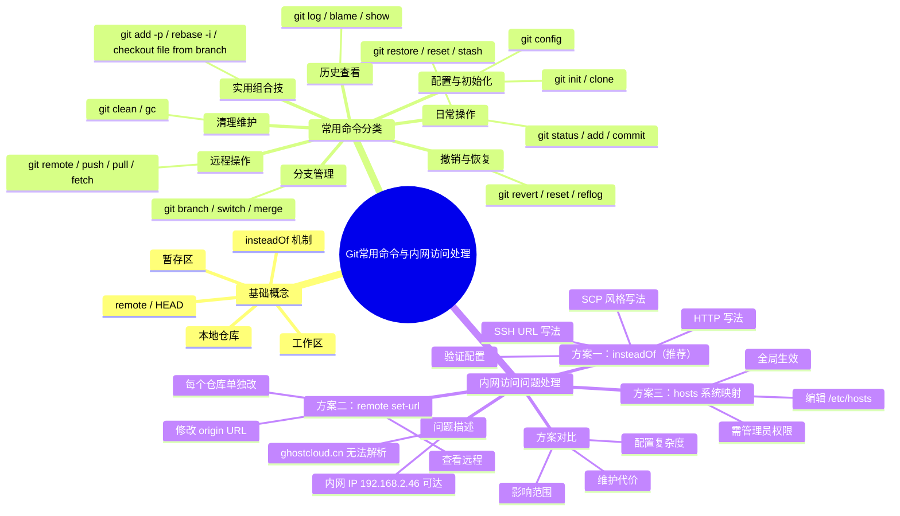

# 知识整合：Git

> 来源节点：[[Git 常用命令与 ghostcloud.cn 内网访问处理]]、[[Git URL 重写 insteadOf]]、[[Git 常用命令与 ghostcloud.cn 内网访问处理 命令清单]]、[[Git]]、[[Git 远程仓库域名访问失败：ghostcloud.cn 改走 192.168.2.46]]

# 技术知识库整合文档

## 0. 中心主题识别

### 0.1 候选中心提示词

| 编号 | 候选中心提示词 | 出现频率/重要性 | 相关资料 | 判断理由 |
|---|---|---|---|---|
| 1 | Git 常用命令 | 高 | 资料1,2,4,5 | 所有资料均涉及大量 Git 命令，且有专门命令清单 |
| 2 | Git URL 重写 insteadOf | 高 | 资料1,2,3,6 | 多个资料聚焦此技术，为问题核心解决方案 |
| 3 | ghostcloud.cn 内网访问失败 | 高 | 资料1,2,3,6 | 排障场景，贯穿所有资料 |
| 4 | 版本控制流程 | 中 | 资料1,2,5 | 仅在资料中出现工作流描述 |

### 0.2 最终中心主题

> 本批资料的中心主题是：围绕 **Git 常用命令** 与 **远程仓库域名访问失败（ghostcloud.cn）通过 insteadOf 进行地址重写** 的技术知识沉淀。包括 Git 基础配置、日常操作、分支管理、远程仓库操作、撤销回退、清理维护，以及三种内网访问解决方案（insteadOf、remote set-url、hosts）的对比与实战。

### 0.3 主题边界

| 分类 | 内容范围 |
|---|---|
| 应进入主知识库 | Git 常用命令（配置、克隆、暂存、提交、历史、分支、远程、撤销、清理、实用组合技）；ghostcloud.cn 内网访问问题（三种方案：insteadOf、remote set-url、hosts）；方案对比与个人经验 |
| 可作为补充素材 | 命令清单（已完全覆盖在常用命令表格中，可精简后纳入） |
| 应进入 Backup | 独立的命令清单文件（资料4）、自动摘要的 Git 节点（资料5）、问题库独立文件（资料6），这些内容与主知识库高度重叠，保留作为参考副本 |
| 可删除候选 | 完全重复的原始导入文件（资料2与资料1内容完全相同） |

## 1. 知识库主题

### 1.1 中心主题

Git 常用命令与 ghostcloud.cn 内网访问处理

### 1.2 知识库定位

本知识库用于个人学习、复习、快速查阅 Git 命令及远程仓库域名访问失败时的解决方案，不用于项目交付。后续可进一步重构为 Git 命令速查表和内网场景排错指南。

### 1.3 内容范围

- Git 基础配置、仓库创建与克隆
- 工作区/暂存区/本地仓库日常操作命令
- 提交历史查看与分支管理
- 远程仓库操作与撤销回退
- 仓库清理与实用组合技
- ghostcloud.cn 域名无法访问时，三种方案（insteadOf、remote set-url、hosts）的原理、配置命令与对比
- 个人经验总结

## 2. 核心知识摘要

- Git 工作流：工作区 → `git add` → 暂存区 → `git commit` → 本地仓库
- 高频命令：`status`、`add`、`commit`、`log`、`branch`、`switch`、`push`、`pull`、`reset`、`stash`、`reflog`
- 撤销策略：本地分支用 `reset`；共享分支用 `revert`
- `git reflog` 是救命命令，可找回误删 commit
- ghostcloud.cn 访问失败时，推荐使用 `url.<base>.insteadOf` 做地址重写，无需修改仓库 remote URL
- 三种方案对比：`insteadOf`（仅影响 Git）、`remote set-url`（简单但需每个仓库改）、`hosts`（全局生效需管理员权限）

## 3. 知识点分类索引

### 3.1 基础概念

| 知识点 | 解释 | 备注/来源 |
|---|---|---|
| 工作区 | 当前编辑的文件目录 | Git 基础 |
| 暂存区（Index） | 用 `git add` 放入，准备提交的区域 | Git 基础 |
| 本地仓库 | `git commit` 后的历史记录存储区 | Git 基础 |
| remote | 远程仓库的别名和 URL | 资料1,2 |
| HEAD | 当前分支的最新提交 | Git 概念 |
| `url.<base>.insteadOf` | Git 地址重写配置，访问前将匹配的 URL 前缀替换 | 资料1,2,3 |

### 3.2 常用命令

| 命令 | 用途 | 使用场景 | 注意事项 |
|---|---|---|---|
| `git config --global user.name "<name>"` | 设置全局用户名 | 初始化 Git 环境 |  |
| `git config --global user.email "<email>"` | 设置全局邮箱 | 同上 |  |
| `git config --global --list` | 查看全局配置 | 检查设置 |  |
| `git config --list` | 查看当前仓库配置 | 检查本地配置 |  |
| `git init` | 初始化当前目录为新仓库 | 新建项目 |  |
| `git clone <url> [dir]` | 克隆远程仓库到本地 | 参与已有项目 | 可指定目录名 |
| `git status` | 查看工作区和暂存区状态 | 日常检查 | `-s` 简洁模式 |
| `git add <file>` | 将文件加入暂存区 | 准备提交 | 可加 `.` 或 `-A` |
| `git commit -m "msg"` | 提交暂存区到本地仓库 | 记录变更 | `-am` 可跳过 add |
| `git commit --amend` | 修改最近一次提交 | 修正提交信息或漏改文件 | 谨慎用于已推送 |
| `git log [--oneline]` | 查看提交历史 | 回顾提交记录 | 可用 `--graph` 可视化 |
| `git switch <branch>` | 切换分支 | 切换工作分支 | 通过 `-c` 创建并切换 |
| `git merge <branch>` | 将指定分支合并到当前分支 | 合并分支 | `--no-ff` 保留分支历史 |
| `git remote -v` | 查看远程仓库地址 | 检查远程配置 |  |
| `git push <remote> <branch>` | 推送本地分支到远程 | 分享提交 | `-u` 建立跟踪关系 |
| `git pull` | 拉取远程并自动合并 | 获取最新代码 | 等价于 fetch + merge |
| `git fetch` | 只拉取远程信息，不合并 | 查看远程更新 |  |
| `git pull --rebase` | 拉取后用 rebase 合并 | 保持线性历史 | 需注意冲突解决 |
| `git reset HEAD~1` | 撤销最近一次 commit，保留修改 | 本地撤回提交 | 有 `--soft/mixed/hard` 三种模式 |
| `git revert <commit>` | 创建新提交抵消指定提交 | 多人协作安全撤销 | 不改变历史 |
| `git stash` | 暂存工作区改动 | 临时切换分支 | `pop` 恢复，`list` 查看 |
| `git reflog` | 查看 HEAD 移动历史 | 找回丢失提交 | 误操作救命命令 |
| `git clean -fd` | 删除未跟踪文件和目录 | 清理工作区 | 危险操作 |
| `git gc` | 压缩仓库优化存储 | 仓库维护 | 可定期执行 |

（以上命令的详细说明参考资料1,2中的表格）

### 3.3 配置项

| 配置项 | 含义 | 示例 | 注意事项 |
|---|---|---|---|
| `user.name` | 提交用户名 | `git config --global user.name "John Doe"` | 全局/局部配置 |
| `user.email` | 提交邮箱 | `git config --global user.email "john@example.com"` | 应与远程账号一致 |
| `url.<base>.insteadOf` | 地址重写 | `git config --global url."http://192.168.2.46/".insteadOf "http://ghostcloud.cn/"` | 只影响 Git，不修改仓库 remote |
| `core.autocrlf` | 换行符转换 | 未在资料中提及 | 按需补充 |
| `push.default` | 推送默认行为 | 未在资料中提及 | 按需补充 |

### 3.4 协议/API/接口

无。

### 3.5 SDK/依赖/工具

| 名称 | 类型 | 用途 | 安装/使用方式 | 备注 |
|---|---|---|---|---|
| Git | 版本控制工具 | 代码版本管理 | 系统安装或包管理器 | 版本 >= 2.0 推荐 |

### 3.6 操作流程/步骤

**场景：ghostcloud.cn 域名无法访问，通过内网 IP 192.168.2.46 访问 Git 远程仓库**

1. 确认当前网络：判断是否仅 Git 访问受阻。
2. 选择方案（推荐 `insteadOf`）：
   - **方案一：`insteadOf`（推荐）**
     - 根据远程仓库 URL 类型执行对应命令：
       - HTTP：`git config --global url."http://192.168.2.46/".insteadOf "http://ghostcloud.cn/"`
       - SSH URL 格式：`git config --global url."ssh://git@192.168.2.46/".insteadOf "ssh://git@ghostcloud.cn/"`
       - SCP 风格：`git config --global url."git@192.168.2.46:".insteadOf "git@ghostcloud.cn:"`
     - 验证：`git config --global --list | grep insteadOf`
     - 之后的 `git pull / push` 自动替换。
   - **方案二：修改 remote URL**
     - 查看当前 remote：`git remote -v`
     - 修改 origin 地址：`git remote set-url origin http://192.168.2.46/你的项目路径.git`
     - 验证：`git remote -v`
   - **方案三：修改系统 hosts**
     - 以管理员身份编辑 hosts 文件（Linux/WSL：`sudo vi /etc/hosts`）
     - 添加映射：`192.168.2.46 ghostcloud.cn`
     - 验证：`ping ghostcloud.cn`
3. 测试访问：执行 `git pull` 验证是否成功。

### 3.7 常见问题与排错

| 问题/报错 | 可能原因 | 解决方式 | 备注 |
|---|---|---|---|
| `git push` 提示“could not resolve host: ghostcloud.cn” | DNS 无法解析域名或域名不可达 | 使用 `insteadOf` 或 hosts 将域名映射到可用 IP | 参见3.6流程 |
| `git push` 仍然使用原始域名（配置 insteadOf 后） | 配置未生效或写错了 URL 前缀（末尾斜杠/冒号） | 检查命令中替换前的字符串是否完全匹配仓库 remote 的开头 | SCP 风格注意末尾冒号 |
| 误用 `git reset --hard HEAD~1` 丢失了提交 | 历史被丢弃 | 使用 `git reflog` 找到之前的 HEAD，然后 `git reset --hard <commit-id>` 恢复 | `reflog` 是救命命令 |
| 多人协作时对共享分支执行了 `git reset --hard` | 历史重写导致队友冲突 | 使用 `git revert` 而非 reset；若已发生，可协商强制推送，但风险极高 | 优先用 revert |
| `hosts` 修改后未生效 | 可能浏览器缓存了 DNS | 刷新 DNS 缓存或重启网络 | 仅系统级生效 |

### 3.8 易混淆点

| 易混淆项 | 区别说明 | 记忆方式 |
|---|---|---|
| `git reset --soft/mixed/hard` | `--soft` 只回退 HEAD，改动留在暂存区；`--mixed` 回退 HEAD 和暂存区，改动留在工作区；`--hard` 丢弃所有改动（危险） | “软（soft）暂存，混（mixed）工作，硬（hard）全丢” |
| `git revert` vs `git reset` | `revert` 创建新提交抵消旧提交，安全用于共享分支；`reset` 直接移除历史，只适合本地分支 | “revert 回滚历史新建，reset 硬改写” |
| `git pull` vs `git fetch` | `fetch` 只下载远程数据，不合并；`pull` = fetch + merge（或 rebase） | “fetch 只看不嫁，pull 直接结婚” |
| `git pull` vs `git pull --rebase` | 默认 pull 使用 merge 合并，生成合并提交；`--rebase` 将本地提交重放在远端提交之上，历史线性 | “pull merge 有分叉，rebase 一条线” |
| `git switch` vs `git checkout` | `switch` 是 Git 2.23 引入的专用于切换分支的新命令；`checkout` 还可以恢复文件，功能更杂 | “新用 switch，旧用 checkout” |

## 4. 主题知识结构图

## 5. Backup 知识素材

### 5.1 中相关素材

- **资料4（命令清单）**：纯命令列表，无说明，与主知识库中的常用命令表格完全重叠，可作为速查列表保留。
- **资料5（Git 节点）**：自动摘要的 Git 节点，内容为主知识库的前言摘要，无独立新增信息。
- **资料6（问题库）**：问题描述与部分命令，已全部
